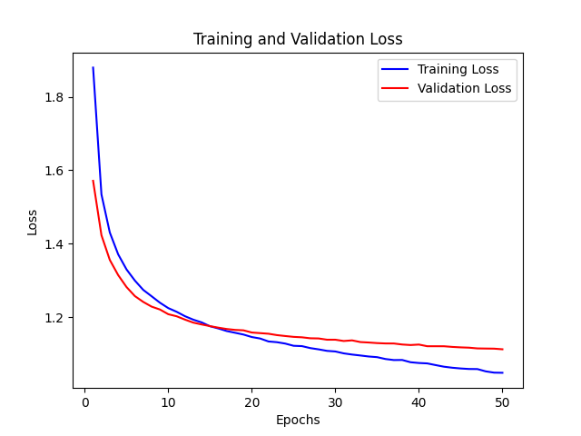

# visual-VGG16-cifar10

For educational purposes.

Multifaceted Python scripts illustrating use of VGG16, a pre-trained CNN, for image classification on CIFAR-10, with Keras & PyTorch. They use transfer learning, early stopping, learning rate reduction, and model checkpointing.

This repository features a set of Python scripts demonstrating the use of the VGG16 model, a pre-trained convolutional neural network, for image classification on the CIFAR-10 dataset. Both TensorFlow/Keras and PyTorch frameworks are used, with scripts showing model creation using functional, sequential and subclassing APIs. The scripts cover data loading, pre-processing, model definition, training, and evaluation. They also utilize model training strategies such as transfer learning, early stopping, learning rate reduction, and model checkpointing. This repository aims to provide resources for those interested in deep learning, computer vision, and understanding the use of pre-trained models in different deep learning frameworks.

The performance of this toy model can be improved. The model's overall performance and per-class performance are shown below.

Train & test set losses by epoch

The classification report provides key metrics for model performance.

                  precision    recall  f1-score   support
    
               0       0.69      0.67      0.68      1000
               1       0.64      0.69      0.66      1000
               2       0.52      0.49      0.51      1000
               3       0.45      0.42      0.43      1000
               4       0.56      0.52      0.54      1000
               5       0.58      0.49      0.53      1000
               6       0.60      0.71      0.65      1000
               7       0.65      0.68      0.66      1000
               8       0.70      0.75      0.73      1000
               9       0.62      0.63      0.63      1000
    
        accuracy                           0.60     10000
       macro avg       0.60      0.60      0.60     10000
    weighted avg       0.60      0.60      0.60     10000

Each row shows the precision, recall, and F1-score for each class, with the last rows summarizing these statistics across all classes.

Class 0 (airplane): The model has a precision of 0.69, meaning that when it predicts an image is an airplane, it's correct 69% of the time. 
The recall is 0.67, indicating it identifies 67% of all airplane images correctly.

Class 1 (automobile): Precision 0.64 and recall 0.69.

Etc.

The F1-score is the harmonic mean of precision and recall. It provides a single score that balances both the precision and the recall. A perfect model would have an F1-score of 1.

In this report, we can see that our model's accuracy is 60%, meaning that it correctly classifies images 60% of the time. 

The macro average calculates the mean of the metric for each class without considering the class distribution. 
The weighted average calculates the mean considering the class distribution. 
In this case, both are the same since the dataset is balanced (1000 images per class).
